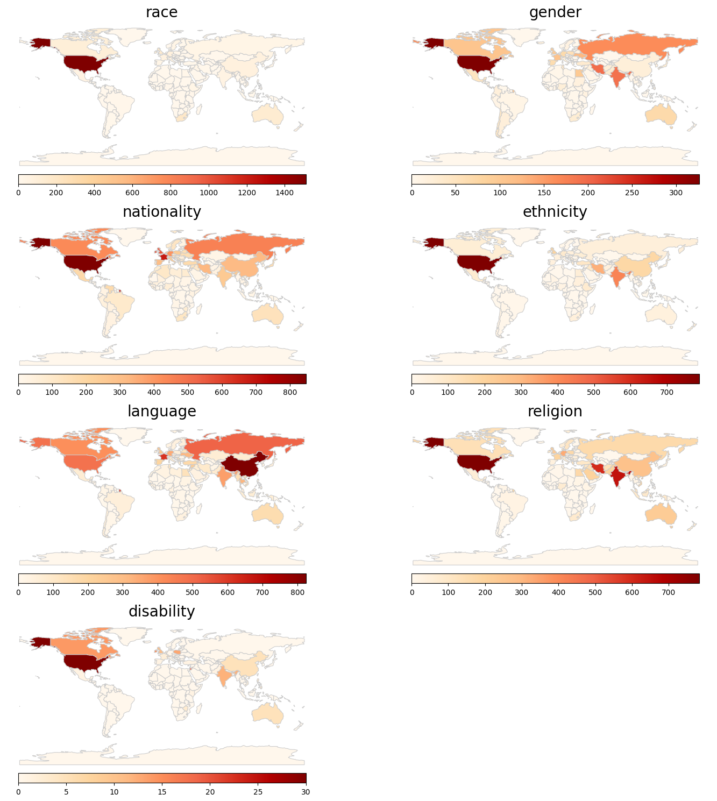

# Mapping Global Protest Tendencies


This repository contains the code and data for the project "Mapping Global Protest Tendencies". 
This project has been conducted by **Jiyun Beak** at the [Industral Engineering department](https://gi.insa-lyon.fr/en/) of [INSA Lyon](https://www.insa-lyon.fr/en/) (National Institute of Applied Science of Lyon) under the supervision of [Ludovic Moncla](https://github.com/ludovicmoncla).


## Methodology

This study investigates the diverse manifestations of 'protest' across cultures and regions, aiming to provide a nuanced understanding of global dynamics and their impact on human rights. 
Utilizing topic modeling methods, we extract a substantial corpus of documents from the English Wikipedia, employing precise clustering techniques to categorize various types of protests based on semantic elements such as race, gender, and language. 
Through cartographic visualization, we illustrate the frequency and distribution of different protest topics. The primary goal is to identify geographic hotspots of human rights conflict, offering a detailed analysis of regional differences in protest propensity. 
This research serves as an initial step towards a comprehensive global understanding of protest dynamics and their implications for human rights worldwide.


List of notebooks: 
- [Data Collection](data_collection.ipynb)
- [Data Preprocessing](data_preprocessing.ipynb)
- [Topic Modeling](topic_modeling.ipynb)
- [Topic Mapping](topic_mapping.ipynb)
- [Topic Visualization](topic_visualization.ipynb)


## Results overview


* Maps show the distribution of the seven predefined topics across the world.


[](outputs/map_zeroshot_KeyBERTInspired_minsize50_minsimilarity0.8.png)

|  | disability | ethnicity | gender | language | nationality | race | religion |
| --------: | ------- | ------- | ------- | ------- | ------- | ------- | ------- |
| United States of America	| 30.0	| 788.0	| 326.0	| 482.0	| 847.0	| 1511.0	| 783.0 |
| Jordan	| 18.0	| NaN	| NaN	| NaN	| NaN	| NaN	| NaN |
| Israel	| 16.0	| 509.0	| NaN	| NaN	| NaN	| NaN	| 572.0 |
| Ireland	| 15.0	| NaN	| NaN	| NaN	| 577.0	| NaN	| NaN |
| Canada	| 14.0	| NaN	| NaN	| 407.0	| NaN	| NaN	| NaN |
| India	| NaN	| 416.0	| 190.0	| NaN	| NaN	| NaN	| 648.0 |
| Iran	| NaN	| 321.0	| 194.0	| NaN	| NaN	| NaN	| 598.0 |
| United Kingdom	| NaN	| 199.0	| NaN	| NaN	| 554.0	| 155.0	| NaN |
| Russia	| NaN	| NaN	| 163.0	| 516.0	| 454.0	| NaN	| NaN |
| Ukraine	| NaN	| NaN	| 123.0	| NaN	| NaN	| NaN	| NaN |
| China	| NaN	| NaN	| NaN	| 824.0	| NaN	| NaN	| NaN |
| France	| NaN	| NaN	| NaN	| 614.0	| 682.0	| NaN	| NaN |
| South Africa	| NaN	| NaN	| NaN	| NaN	| NaN	| 183.0	| NaN |
| Georgia	| NaN	| NaN	| NaN	| NaN	| NaN	| 149.0	| NaN |
| Australia	| NaN	| NaN	| NaN	| NaN	| NaN	| 143.0	| NaN |
| Germany	| NaN	| NaN	| NaN	| NaN	| NaN	| NaN	| 329.0 |


Results show that USA is in the top five of the most frequent country names for all the seven predefined topics while, Israel, India, Iran, United Kingdom and Russia are in the top 5 for 3 topics. Also, \textit{France} is in the top 5 for `nationality` and `language`, Ireland for `nationality` and `disability`, Canada for `disability` and `language`, China for `language`, and South Africa and Australia for `race`.


## Reproduce the experiment

### Configure a Python virtual environment

```bash
python -m pip install -r requirements.txt
python -m spacy download en_core_web_sm
```

### (optionnal) Set the Environment Variable for the OpenAI API key

```bash
export OPENAI_API_KEY=<your_api_key>
```


## Cite this work

> Beak, J. and Moncla, L. (2024). Mapping Global Protest Tendencies: Geolocating Trends and Topics Through Wikipedia Analysis. In proceedings of the 2nd International Workshop on Geographic Information Extraction from Texts (GeoExT'24), ECIR Conference, Glasgow, UK.